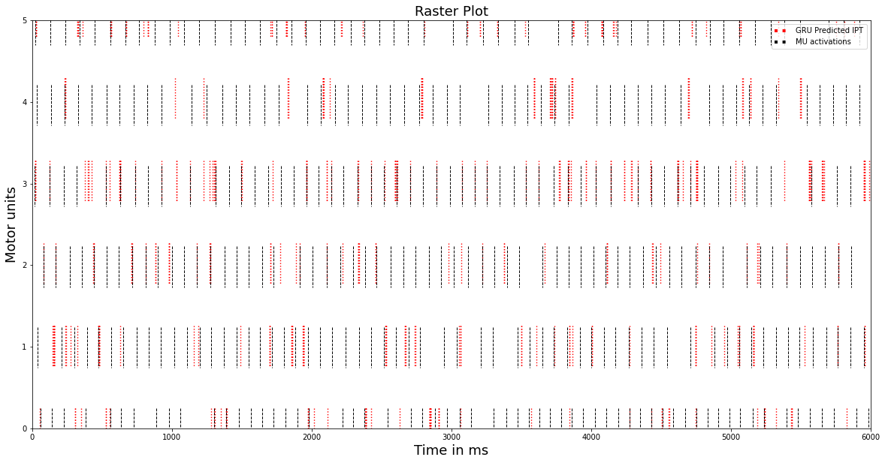

# Gated Recurrent Unit Networks for Decomposition of Synthetic High-Density Surface EMG Signals

This is the repo for the student project of Srijay, supervised by Lena Lehmann and Benjamin Maier.

## Framework
Following packages are used:
* Tensorflow 2.1
* Keras 
* Matplotlib
* scipy
* sklearn


## Setup
To run this project, install above mentioned packages:
```python
$ pip install -r requirements.txt
```
Please find the dataset in the Dataset folder.

## Run
 ```python
$ python filename.py /dataset_path/electrodes.csv+stimuation file/
```
Filename:
* MU_activation_model.py 
* RAW_IPT_MODEL

## Description

The goal of this project was to decompose simulated Surface Electromyography signal to its constituent Motor unit firing patterns.
Gated Recurrent Unit deep learning model was trained on the dataset with high-density surface Electrodes with corresponding stimulation time of each Motor unit.
Two different methods of implementation were employed with different preprocessing steps.
For more information on the project, please find the attached presentation file.

## Citation
'''
Clarke, Alexander & Atashzar, Seyed Farokh & Del Vecchio, Alessandro & Barsakcioglu, Deren & Muceli, Silvia & Bentley, Paul & Urh, Filip & Holobar, Ales & Farina, Dario. (2020). Deep Learning for Robust Decomposition of High-Density Surface EMG Signals. IEEE Transactions on Biomedical Engineering. PP. 1-1. 10.1109/TBME.2020.3006508. 
'''

## Results

Results are visualized in the Raster plot to compare the performance of different decomposition techniques and ground truth.



